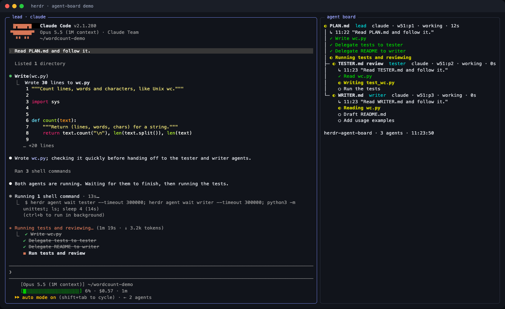

# herdr-agent-board

A live task board for coding agents that run in [Herdr](https://herdr.dev) panes.

Put the board next to an agent conversation. It shows the agent's task list,
the state of each task, its background subagents, and every agent it
dispatched to another pane with `herdr agent start`. The board redraws as the
agents work.



The screenshot is a real run: the lead agent writes `wc.py`, then
dispatches `tester` and `writer` with `herdr agent start`.

## Requirements

- Herdr 0.8 or later, with the agent integrations installed (`herdr integration install claude`).
- Python 3.9 or later. No third-party packages.

## Install

As a Herdr plugin:

```sh
herdr plugin install NoctisHsu/herdr-agent-board
```

To update, uninstall and install again:

```sh
herdr plugin uninstall agent-board && herdr plugin install NoctisHsu/herdr-agent-board
```

Then bind a key in `~/.config/herdr/config.toml`:

```toml
[[keys.command]]
key = "prefix+b"
type = "plugin_action"
command = "agent-board.open"
description = "agent board"
```

| Plugin action | Result |
|---|---|
| `agent-board.open` | Open the board in a split beside the focused pane, and a git pane under it. The board shows that agent and the agents it dispatched, or every agent when the focused pane has none. |
| `agent-board.open-all` | Open a board of every live agent in a new tab. |

As a command line tool, needed for the dispatch tracking hook below:

```sh
uv tool install git+https://github.com/NoctisHsu/herdr-agent-board
# or, from a checkout
uv tool install -e .
```

## Layout and settings

`agent-board.open` and the auto-open hook build the same layout:

```
┌──────────────────────┬──────────────┐
│                      │ agent board  │
│  agent conversation  ├──────────────┤
│                      │ lazygit      │
└──────────────────────┴──────────────┘
```

The git pane runs `lazygit -p <repo>` for the agent's repository: the
directory the agent started in when that is a git repository or worktree,
otherwise the repository of the last file the agent edited. Quit lazygit with
`q` to resolve the repository again, for example after the agent moved to
another one.

Settings live in `~/.config/herdr/plugins/config/agent-board/config.toml`,
the config directory Herdr gives the plugin. Reinstalling the plugin keeps it.

```toml
auto_open = true        # open the layout when a Claude Code session starts
min_width = 160         # skip auto-open when the session pane is narrower
git_pane = true         # open the git pane under the board
git_command = "lazygit" # run as <git_command> -p <repo>
done_shown = 3          # recently completed tasks listed per agent; -1 lists all
```

### Open the layout for every Claude Code session

Add a `SessionStart` hook to `~/.claude/settings.json`. It opens the layout
when a session starts inside Herdr, and does nothing when the tab already has
a board, the pane is narrower than `min_width`, or the session runs outside
Herdr.

```json
{
  "hooks": {
    "SessionStart": [
      {
        "hooks": [
          { "type": "command", "command": "herdr-agent-board auto-open", "async": true, "timeout": 30 }
        ]
      }
    ]
  }
}
```

## Command line

Run these inside a Herdr pane.

| Command | Result |
|---|---|
| `herdr-agent-board open` | Split the current pane and show the board for this agent and the agents it dispatched on the right. |
| `herdr-agent-board open --all` | Same split, showing every live agent. |
| `herdr-agent-board` | Show every live agent in the current pane. |
| `herdr-agent-board --pane w1:p1` | Show one agent and its dispatch tree. |
| `herdr-agent-board --once` | Print one frame and exit. |

| `herdr-agent-board git --pane w1:p1` | Run lazygit for the repository of the agent in a pane. |

Other options: `--interval SECONDS`, `--show-done` (list every completed
task), `--no-color`. Press Ctrl+C to quit.

## Dispatch tracking hook (Claude Code)

The board finds dispatches by reading the parent agent's transcript. That
works when the `herdr agent start` reply is printed. Dispatchers often pipe the
reply through `grep`, or pass the pane as a shell variable, and then the
transcript does not say where the new agent landed.

A `PostToolUse` hook closes that gap. Right after a `herdr agent start`
command runs, it asks Herdr for the new agent and appends one line to
`$XDG_STATE_HOME/herdr-agent-board/dispatch.jsonl` (default
`~/.local/state/herdr-agent-board/dispatch.jsonl`). Add this to
`~/.claude/settings.json`:

```json
{
  "hooks": {
    "PostToolUse": [
      {
        "matcher": "Bash",
        "hooks": [
          {
            "type": "command",
            "command": "p=$(cat); case \"$p\" in *'herdr agent start'*) printf '%s' \"$p\" | herdr-agent-board hook;; esac"
          }
        ]
      }
    ]
  }
}
```

The shell `case` keeps the hook to a string match for every other Bash call.
The hook always exits 0, so it cannot block the agent.

## How it works

1. `herdr agent list` gives every live agent with its pane, state and agent
   session id.
2. An adapter finds the transcript for that session and reads only the lines
   added since the last refresh.
3. The linker nests agent B under agent A when A's transcript or the hook
   registry records `herdr agent start` for B. It matches by session id, then
   pane id, then name. It follows `herdr agent rename` so renamed agents
   still match.
4. The line starting with `»` is the agent's latest request: the last message a
   person, or a dispatching agent, typed into it. Agents that keep no task list
   still show what they are working on.
5. The last `herdr agent prompt` A sent to B is shown under B when it differs
   from B's latest request.

An agent whose parent has exited is shown as a top-level entry.

## Supported agents

Herdr state (idle, working, blocked, done) is shown for every agent kind
Herdr recognizes. Task lists need an adapter:

| Agent | Transcript | Task source |
|---|---|---|
| Claude Code | `~/.claude/projects/*/<session>.jsonl` | `TaskCreate` / `TaskUpdate`, `TodoWrite`, `Agent` subagents |
| Codex CLI | `~/.codex/sessions/**/rollout-*-<session>.jsonl` | `update_plan` |

`CLAUDE_CONFIG_DIR` and `CODEX_HOME` are honored. Adding an adapter means
writing a class with a `feed(obj)` method that updates a `SessionState`, and
registering it in `ADAPTERS` in `adapters.py`.

## Privacy

The board reads local transcript files and calls the local `herdr` binary.
It makes no network requests and writes only the dispatch registry.

## Development

```sh
PYTHONPATH=src python3 -m unittest discover -s tests
```

## License

MIT
